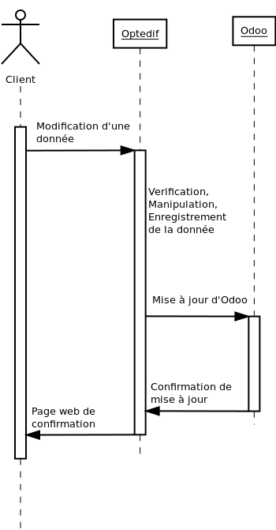
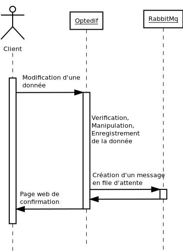
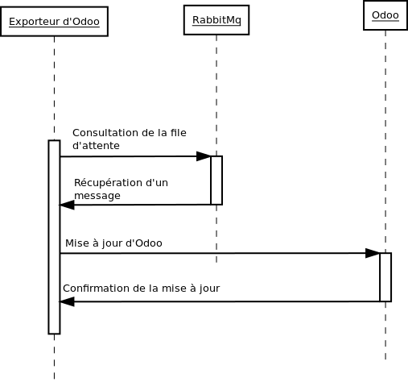
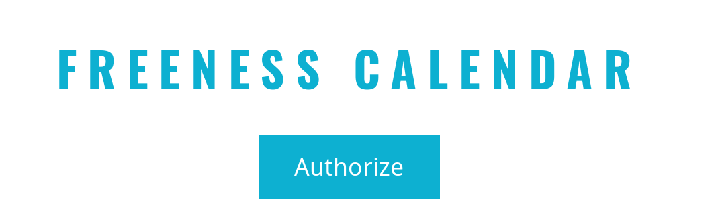
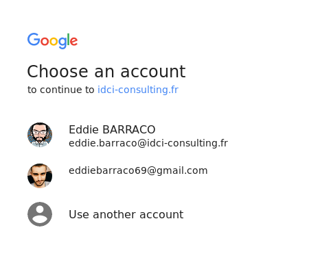
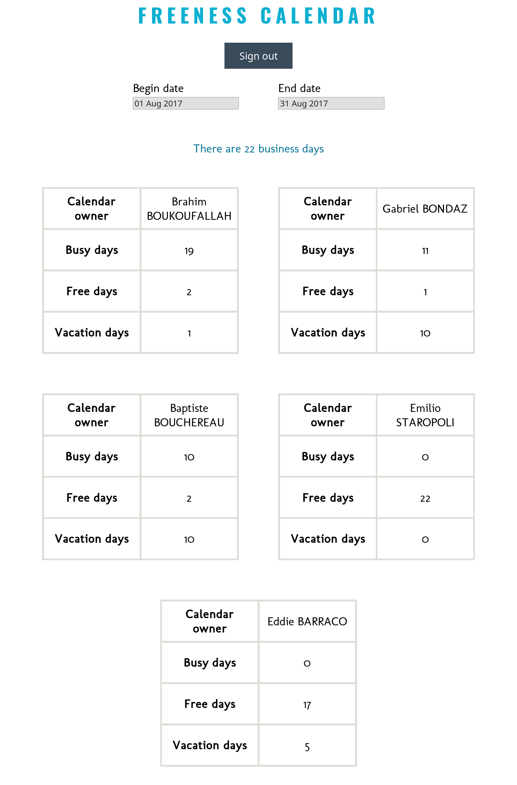
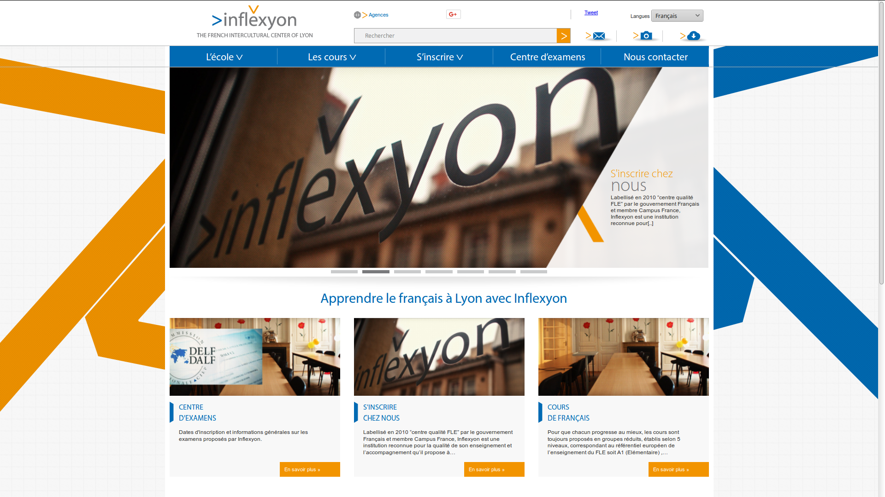

# Remerciements

Je tiens à remercier dans un premier temps, toute l'équipe pédagogique de l'IUT informatique de Bourg-en-Bresse et les intervenants professionnels de la formation METINET, pour nous avoir transmis leurs expériences.

Je tiens à remercier toute l'équipe d'IDCI-Consulting pour l'accompagnement qu'elle m'a apporté depuis déjà plus d'un an.
Je remercie plus particulièrement Brahim Boukoufallah pour sa disponibilité et l'attention qu'il m'a consacrée jusqu'à aujourd'hui, ainsi que Baptiste Bouchereau et Gabriel Bondaz pour toute l'expérience dont ils m'ont fait profiter.

Je remercie également Adrien Peytavie pour son accompagnement depuis mon stage en DUT jusqu'à la fin de cette année METINET.

# Résumé

[IDCI-Consulting](https://www.idci-consulting.fr/) est une entreprise de services du numérique (ou ESN). Ce rapport présente tout d'abord l'entreprise et son environnement de travail, et rend compte du développement des différentes missions par un descriptif de celles-ci suivi d'une étude fonctionnelle et technologique.

Les missions sur lesquelles j'ai contribué sont multiples. Tout d'abord je présenterai l'application [Optedif](https://optedif-formation.fr/) sur laquelle j'ai débuté mes développements au cours de ce cycle d'apprentissage. Ensuite je reviendrai sur le projet [Upsters](http://upsters.fr/) que nous avons repris et portés à l'état fonctionnel.

J'ai également été chargé de développer une application interne permettant de calculer les disponibilités des collaborateurs d'IDCI-Consulting. Je présenterai donc les outils que j'ai utilisés et pourquoi. Je développerai également le fonctionnement de cet outil ainsi que ses évolutions futures.

Enfin je présenterai au cours d'une dernière partie, tout le bilan d'une analyse que nous avons effectué du système d'information de la compagnie [Inflexyon](http://www.inflexyon.com/). Cette entreprise lyonnaise qui ne cesse de se développer et qui doit faire évoluer son SI.

Je conclurai enfin par mes différents retours concernant l'entreprise mais également le cadre pédagogique de cette année ainsi que de l'évolution à court terme de ma vie professionnelle au sein d'IDCI-Consulting.

Je vous remercie de votre lecture.

# Table des matières

# Introduction

## Rappel sur l'entreprise

IDCI-Consulting est une ESN au capital de 10 000 €, créée le 10 décembre 2007 à l'initiative de Gabriel Bondaz et Frédéric Bondaz. L'activité principale consiste en la conception, le développement et le maintien de sites web s'appuyant sur des technologies open source : il s'agit généralement d'applications web PHP complexes telles que des solutions de commerce en ligne, de la gestion d'événements, d'outils internes à d'autres entreprises, etc.

En plus du développement, IDCI-Consulting propose des formations dans le domaine du développement informatique. Cela peut être pour ses clients afin de leur permettre de prendre en main leur site, ou pour d'autres entreprises soucieuses de découvrir des technologies de pointe. Enfin, IDCI-Consulting propose aux entreprises des consultants qui apportent à ces dernières un support et des compétences d'experts.

## Environnement de travail

La SARL IDCI-Consulting est une petite structure se composant (moi inclus) de cinq collaborateurs : Gabriel Bondaz (gérant/analyste développeur), Frédéric Bondaz (gérant), Baptiste Bouchereau (gérant/analyste développeur), Brahim Boukoufallah (développeur) et Eddie Barraco (développeur).

Tous les postes de travail de la société sont sous système d'exploitation libre : Ubuntu, Debian et ArchLinux. Tous les logiciels utilisés sont également libres et gratuits. Ceux couramment utilisés sont :

- Git : un outil de gestion de version.
- Docker : un outil permettant de créer des environnements (appelés conteneurs) isolant des applications.
- Gimp : un logiciel de graphisme et retouche d'images.
- Dia : un logiciel de création de schéma.
- Umbrello : un logiciel permettant la création de diagrammes UML.
- LibreOffice : un logiciel permettant de créer des documents de tous types (.doc, .pdf, etc)
- Chromium, Firefox : navigateurs web performants.
- Vim, Gedit : éditeurs de texte.

IDCI-Consulting dispose d'un serveur de développement et propose aussi des outils de travail en équipe :

### Un outil d'hébergement et de gestion de développement logiciels

Une très grande majorité des codes open source sont aujourd'hui hébergés sur Github et sont disponibles via Git. C'est l'outil que nous avons utilisé majoritairement ces dernières années. Le code source n'est donc pas hébergé sur nos serveurs mais sur les serveurs de Github. C'est pourquoi IDCI-Consulting a mis à disposition un service similaire à Github : Gitlab. Gitlab nous permet à contrario de privatiser certains de nos codes sources.

### Un outil de gestion de projets

Les demandes de mise à jour, d'évolution de logiciel et les reports de bogue de la part des clients sont dans les services informatiques très fréquentes. Pour éviter de fonctionner par mail et de se perdre dans une multitude d'informations, il est préférable d'utiliser des outils de gestion de projets.

IDCI-Consulting met à disposition Redmine qui joue ce rôle. Le client ajoute un ticket, c'est-à-dire une demande, qui peut être traitée en fonction de son état d'urgence, de l'échéance, etc.

### Une plate-forme de stockage

Le stockage en ligne « Cloud » est devenu un moyen connu pour gérer nos fichiers numériques. Nous sommes de plus en plus jongleurs entre les appareils qui peuvent être un ordinateur portable, de bureau ou encore notre smartphone.

IDCI-Consulting propose un service de stockage à ses collaborateurs : Owncloud. Cela signifie que nous avons la possibilité de mettre à disposition nos fichiers dans le Cloud n'importe quand, n'importe où et comme nous le voulons.

### Une base de connaissance

Un wiki est un outil de travail collaboratif. C'est un site web librement modifiable par ses visiteurs, sans difficultés techniques, et qui permet la libre circulation de l'information au sein de l'entreprise.

Chez IDCI-Consulting, nous utilisons DokuWiki. La particularité de celui-ci est qu'il ne nécessite pas de base de données (toutes les données sont stockées dans des fichiers texte).

### Un outil d'édition de texte collaboratif.

Le Pad est un outil d'édition de texte en direct et collaboratif. Il permet une prise de note groupé ainsi que le partage d'information légère simple et non protégé.

### Un gestionnaire de mot de passe

Teampass est un outil de gestion de mot de passe d'équipe. L'ensemble de nos outils ont des accès admins (serveurs, service de gestion DNS, accès aux réseaux sociaux, etc). Nous cherchions un moyen efficace de lier robustesse et simplicité. Nous avons donc groupé les mots de passes complexes dans un outil aux accès restreints. Ainsi les mots de passes sont uniques par application, très complexes et accessibles facilement dans une application sécurisée et hébergée sur nos serveurs.

L'idée d'utiliser ce type d'outil émane de moi. J'ai sélectionné et mis en place Teampass moi-même sur le serveur de développement d'IDCI.

## Mon rôle chez IDCI-Consulting

J'interviens au sein de la société de manière polyvalente. Mes tâches vont du développement d'outil internes jusqu'à l'élaboration d'application web client à forte plus-value (valeur ajoutée ?), complexes et nécessitant un travail d'équipe ainsi que des connaissances techniques sur lesquelles je monte en compétence. Je travaille principalement sur les technologies du web, à savoir PHP, JavaScript, HTML et CSS. J'utilise les frameworks Symfony et VueJs. Je base mes travaux sur des technologies uniquement open source.

# Les projets pour lesquels j'ai contribué

Dans cette partie je vais évoquer les différents projets pour lesquels j'ai contribué. Je commencerai par présenter ces projets. J'expliquerai ensuite dans quelle mesure j'ai contribué aux projets. Enfin je rapporterai l'état actuel ainsi que les évolutions envisageables pour ces projets.

## Le projet Optedif

Optedif est un outil de mise en relations entre des personnes qui donnent des formations et des personnes qui en cherchent. Il est basé sur le framework Symfony 2.8 ainsi que d'une base de donnée MySQL. Il est le fruit d'un développement _from scratch_ datant de 2016. Cette plateforme a beaucoup évolué depuis sa création et est passée entre les mains de plusieurs développeurs.

### Reprise du projet

IDCI-Consulting a repris le projet début 2016. J'ai donc travaillé sur Optedif depuis le début de mon stage ainsi que durant une partie de ma Licence Pro. Optedif constituait encore au début de cette année de Licence Professionnelle, une grosse partie de mes développements au sein d'IDCI-Consulting.

### Nos développements sur Optedif

Ce projet a pour moi été ma première expérience avec le Framework Symfony. C'est sous la tutelle de Brahim Boukoufallah que j'ai pu faire progresser ma compréhension de Frameworks plus complexes.

Un des développements les plus notables auxquels j'ai participé sur Optedif concernait un problème de performance. Les manipulations des données prenaient beaucoup de temps et cela rendait la navigation lente. Cette lenteur découlait d'un grand nombre d'actions exécuté pour manipuler les objets. Une des tâches les plus gourmandes en ressource concernait les exportations vers Odoo.

Le client utilise un serveur Odoo (voir lexique) pour analyser les données clientes. L'application Symfony doit donc synchroniser ses données vers l'application Odoo via le protocole XML-RPC. Le souci est que l'export des données se faisait de manière synchrone sur la requête du navigateur web des clients. Ainsi le client devait attendre que les processus soient terminés pour accéder aux pages web de réponse. Nous avons donc travaillé à désynchroniser cette tache d'export.

Nous avons utilisé RabbitMq qui est un gestionnaire de file d'attente de type Queuing pour cette tâche. Concrètement l'application Symfony informait un tiers qu'une donnée avait été créée ou modifiée. Ce tiers conservait l'information au travers une file d'attente. Enfin un processus PHP se chargeait de récupérer ses informations pour traiter l'export vers Odoo. Ainsi ce n'était plus le processus, chargé de fournir une confirmation au client, de traiter aussi l'export. Nous avons donc fait grandir l'application de manière horizontale permettant de traiter des tâches coûteuses en tâches de fond.

Avant | Après
:---:|:---:
 |  
||

### Accompagnement vers la passation

En fin d'année 2016, IDCI-Consulting a exprimé son besoin de ne plus maintenir le site Optedif. Notre client a donc trouvé un nouveau collaborateur pour continuer de développer son projet. IDCI-Consulting a tout de même été missionné pour manager la passation, répondre aux différentes interrogations ainsi que de migrer le code source vers une nouvelle plateforme.

Le code source était précédemment hébergé sur BitBucket et il a été migré sur un GitLab mis en place spécialement pour ce projet. La structure git du projet en elle-même à également été revue. Avant nous utilisions un ensemble de branche pour différencier les codes sources prod, pre-prod et dev. Il a finalement été décidé de passer à une structure plus simple basée sur deux branches master et dev. La modification de cette structure était à tester, vérifier et réaliser sur un dépôt de test pour assurer l'intégrité du projet.

## Le projet Upsters

Upsters est une plateforme gratuite, permettant aux entrepreneurs d'être mis en relation avec des ressources dont ils auront besoin pour porter la création de leur(s) projet(s). Ce projet est issu de l'initiative de [Ludovic Rerolle](https://www.linkedin.com/in/ludovic-rerolle-59354b21/) et de [Julie Borgeot](https://www.linkedin.com/in/julie-borgeot-2934775a/).

### Reprise du projet

Le site Upsters a été commencé par un développeur indépendant débutant sur le framework Symfony. Ce travailleur a abandonné le développement pour raison personnelle. Ainsi le client Dozee s'est mis en quête d'une équipe de développeurs pour porter le projet à son terme. La reprise du projet a donc commencé par une analyse du projet ainsi que du diagnostic de l'état du code.

### Les développements sur Upsters

Upsters n'était pas fonctionnel lorsque nous avons repris le projet. Un grand nombre de fonctionnalités était absente ou seulement partiellement en place. Il y a eu également quelques parties du code source à améliorer suites à des erreurs précédentes basées sur une méconnaissance du framework.

Je suis intervenu sur différents points sur ce projet. J'ai réalisé un très grand nombre de petites choses sur ce projet. Il serait peu pertinent d'en faire ici une liste exhaustive. En revanche c'est la une bonne occasion de présenter notre méthode de développement.

Au sein d'IDCI nous tenons à utiliser des méthodes de développement le plus proche des méthodes agiles. Les objectifs sont généralement d'ajouter des fonctionnalités de manière incrémentale et d'être toujours au plus proche de ce que le client veut. Le cas d'Upsters est un exemple typique de cette méthode de développement. Nous n'utilisons pas de méthode agile normée telle que Scrum à proprement parler, mais nous basons nos développements autour de tickets. En cas de besoin de fonctionnalité ou de correction d'un bogue, le client ouvre un ticket sur notre application Redmine en donnant le plus de détail possible sur sa demande. Nous commençons un échange dans le but d'obtenir tous les tenants et aboutissant des ajouts et, ou modifications à effectuer. Enfin nous devisons un temps pour réaliser ce ticket et nous partons sur le développement.

La méthode des tickets permet d'archiver les échanges avec le client ainsi que de garder un suivi clair de l'avancement d'un projet. Elle permet également de simplifier la facturation car elle convient d'un accord liant un ensemble de tâches avec un temps de développement facturé. Nous basons autant que possible nos développements autour de cette méthode.

### État actuel du projet

En juillet 2017, La Lyon French Tech a émis un appel d'offre concernant une application de mise en relation de professionnel correspondant beaucoup au projet Upsters. Dozee a donc répondu à cet appel d'offre. Dozee espérait premièrement obtenir un partenariat avec IDCI-Consulting. Il voulait s'assurer une équipe de développeur capable de faire évoluer Upsters pour le faire correspondre plus exactement avec l'appel d'offre. Nous avons été conduis à décliner cette demande, faute de ressources disponibles sur la période de septembre. Dozee a donc dû chercher de nouveaux collaborateurs pour continuer les développements sur le projet.

# Un outil de gestion des ressources

## Le besoin de suivi

Les collaborateurs IDCI-Consulting utilisent l'outil Google Calendar pour la gestion de leurs calendriers. Cet outil permet d'avoir un suivi des projets sur lesquels nous travaillons ainsi que de partager des évènements entre nous. En revanche il ne permet pas d'avoir clairement un retour sur nos disponibilités. Il m'a été demandé de développer un outil se basant sur les API de Google Calendar pour afficher un certain nombre d'informations. Dans un premier temps, seul les disponibilités devaient être calculées entre deux dates.

## Un framework Front End

Pour le développement de cet outil j'ai décidé d'utiliser le framework VueJs. VueJs est un framework javascript front exécuté dans le navigateur client. Cela permet d'avoir une application interactive et qui ne fonctionne pas sur la base requête/réponse des applications PHP. L'utilisation de VueJs était également pour moi l'occasion de monter en compétence sur cette technologie qui est de plus en plus utilisé au sein du monde du web.

## Les autres technologies utilisées

Pour travailler avec les API Google, Google propose un outil client javascript permettant un accès simplifié aux différentes API. Je peux donc récupérer aisément l'ensemble des calendriers ainsi que des événements qui y sont contenus. Ainsi j'ai tout le loisir de traiter ces données pour l'afficher dans mon application VueJs.

J'ai également profité de ce projet pour monter en compétence sur l'outil Webpack. Webpack est un outil de gestion de dépendances majoritairement utilisé dans les projets Nodejs. Il permet d'automatiser la génération de sources js, css et images fournis aux clients. Il permet entre autre de rendre compatible aux différents navigateurs tous les codes basés aux normes récentes.

## Méthode de fonctionnement

L'outil se base sur une grammaire précise pour détecter les agendas de nos collaborateurs ainsi que les évènements liés aux travaux facturés. Il prend compte du nom des éléments pour déterminer le type de celui-ci. Les éléments pris en compte dans le calcul des disponibilités sont ceux qui utilisent la forme 'Projet [ENTREPRISE]'. Nous avons donc définis une norme de notation permettant à l'outil de ne pas commettre d'erreur, de ne pas "oublier" d'évènements. Des erreurs humaines peuvent ainsi toujours subvenir si la norme est oubliée.

Une autre possibilité aurait été de créer des agendas spécifiques par projet. Tous les évènements contenus dans ces agendas seraient utilisés pour calculer les disponibilités. Cela éviterait les fautes de frappes car l'outil ne chercherait plus à détecter les évènements. Il additionnerait les temps de tous les événements pour calculer les disponibilités.

Dans un souci de rétro-compatibilité ainsi que pour éviter d'être submergés d'agendas, nous avons décidé de préserver nos agendas actuels et donc de normer les évènements.

## Rendu final

L'application a besoin de se connecter au compte Google pour avoir accès aux bons calendriers. Ainsi elle récupère l'accès aux différents calendriers des collaborateurs.

Une fois l'accès validé, l'application récupère via les API tous les évènements de tous les calendriers des collaborateurs et calcul les disponibilités.

Ce que les photographies ne montrent pas c'est que l'application est interactive. Les blocs de sélection de date en haut ne sont pas validés par un bouton. Le contenu de la page s'actualise automatiquement lorsque une nouvelle date est sélectionnée.

## Pistes d'amélioration

L'outil a pour objectif d'évoluer en fonction de nos besoins. Il pourra par exemple inclure d'autres fonctionnalités comme rendre des informations plus détaillées concernant le nombre d'heures passé par projet.

# L'analyse du projet Inflexyon

Inflexyon est une entreprise Lyonnaise qui propose un ensemble de service autour de cultures française et étrangères. Elle propose par exemple des cours de langue, des ateliers de différents types, un centre d'examen, des aides au logement et bien d'autres choses.

Inflexyon existe depuis près de 10 ans et a vu son besoin de système d'information complète augmenter progressivement. IDCI-Consulting a été sollicité pour apporter son analyse du SI actuel et pour exprimer un ensemble de proposition dans le but de l'améliorer. L'idée sous-jacente est que si nos propositions d'améliorations ainsi que notre estimation de leurs coûts correspondaient aux attentes d'Inflexyon, IDCI et Inflexyon deviendraient collaborateurs pour faire évoluer ce SI.

Notre intervention s'est déroulé en trois étapes :

- Des entretiens avec certaines personnes travaillant chez Inflexyon dans le but d'obtenir un ensemble d'information concernant leurs métiers et pour mieux comprendre leurs différents besoins.
- La rédaction d'un document comprenant un récapitulatif de nos pistes d'amélioration ainsi qu'un devis des coûts pour les réaliser.
- Une présentation devant leurs équipes du projet global pour convaincre l'ensemble de l'équipe d'Inflexyon.

Il a également été exprimé le besoin d'unifier les différents services pour simplifier le suivit des différents processus.

Gabriel Bondaz et moi-même avons conduit Inflexyon à la réflexion de son SI au cours de ces différentes étapes. Notre objectif était d'apporter un ou plusieurs ensembles d'outils permettant d'aider Inflexyon dans son développement d'offres toujours plus varié.

## Entretiens chez Inflexyon

Nous avons donc tout d'abord sollicité certains membres de l'équipe d'Inflexyon pour mieux comprendre leurs besoins. Deux jours ont été consommés dans les locaux d'Inflexyon pour échanger avec l'équipe autour de différentes pistes d'amélioration.

Le SI en œuvre à cette époque fonctionnait comme suit :

- Chacun des services d'Inflexyon est géré par des personnes différentes et avec des méthodes différentes. Ce découpage des services est historique car avant ce besoin d'unifier, c'est bien un ensemble d'offre qui coexistant dans l'écosystème d'Inflexyon.
- Le stockage des données (clients, offres, services, logements, examens) est effectué dans des tableurs Google Excel variés. Cette méthode assure à chacun une persistance des données mais oblige une grande redondance en fonction des services. Les informations clients se retrouvent dans la fiche d'aide au logement, dans celle des cours auquel il participe, dans celle destinée au comptable, etc.

Il a rapidement été convenu que la méthode actuelle ne convenait plus à la bonne croissance et ce pour plusieurs raisons :

- Difficulté de suivi global des processus
- Redondance d'informations
- Analyse de l'état de santé d'Inflexyon impossible
- Impossibilité de partager le travail car chaque donnée est personnelle aux travailleurs
- Difficulté à effectuer le suivit des clients au travers des services

## Phase d'analyse et de conception interne

Pour répondre aux problématiques exprimées nous avons rapidement proposé que nous partions directement sur l'idée de développer un nouvel outil globalisant les différents services d'Inflexyon. L'absence d'un socle commun rend difficile la réutilisation de morceaux d'outils dans un nouveau système.

Dans cette partie je vous présente le compte rendu partiel que nous avons rendu à Inflexyon.

### Structure de l'architecture serveur

Nous recommandons un serveur Debian 9 Stretch pour le support des applications récentes.

- Serveur PHP fpm 7 ou supérieur
- Serveur Nginx 1.12 ou supérieur
- Serveur MySql 5.7 ou supérieur
- Serveur ElasticSearch 5.5 ou supérieur

Il est indispensable de disposer d'un serveur dédié avec un accès root via ssh. Notre proposition ne prend pas en compte les coûts d'hébergement ainsi que de location des noms de domaines. Nous pourrons les accompagner sur les démarches nécessaires à la mise en place du serveur.

### Structure de l'application Symfony

Inflexyon regroupe un ensemble de services qui se basent tous sur un socle commun. Nous avons pensé un certain nombre de bundle se basant tous sur un cœur unique. Voici la liste exhaustive de ces bundles :

- Bundle InflexyonCustomer
- Bundle InflexyonAccommodation
- Bundle InflexyonAgency
- Bundle InflexyonForm
- Bundle InflexyonDocument
- Bundle InflexyonNotification

Nous préconisons l'utilisation des bundles existants suivant :

- Doctrine ORM : Couche accès aux données
- FosRestBundle : Gestion des API rest
- IDCIStepBundle : Gestion des formulaires (parcours inscription)
- IDCINotificationBundle : Gestion des notifications

### Schéma des entités du lot 1

Les schémas correspondent à la représentation des données en utilisant le langage UML. Ces schémas sont susceptibles d'évoluer lors de la phase de réalisation. Nous avons volontairement axé notre analyse autour d'unités fonctionnelles indépendantes.

#### Lot Core

#### Lot logement

#### Lot agence

## Présentation devant les équipes Inflexyon

C'est le mercredi 19 juillet que nous avons finalement présenté notre compte rendu devant toute l'équipe d'Inflexyon. Cette présentation a été pour nous tous l'occasion d'échanger et de répondre aux différentes questions et inquiétudes de nos interlocuteurs.

## État du projet

Nous avons reçu une réponse positive de la part d'Inflexyon concernant la poursuite de ce projet ainsi que le début des développements. Les développements débuteront dont au cours du mois de septembre. Ce projet va principalement me mobiliser pendant une longue période. Le premier lot devrait donc être livré en fin d'année 2017.

# Mes retours

Dans cette partie je vais exprimer mes retours positifs et négatifs sur cette année donc sur la licence ainsi que sur mon entreprise.

## IDCI Consulting

IDCI Consulting a été pour moi le parfait milieu pour m'épanouir professionnellement. J'y ai pu exercer ma créativité et laisser exprimer mon instinct et mes envies d'expérimentation. J'ai tout de même disposé d'un cadre suffisamment strict pour me guider vers les meilleures pistes de conception et pour me fournir un socle d'expériences fortes. Je suis resté entouré de développeurs compétents et intègres dans leurs choix. J'ai pu travailler sur différents projets avec des contraintes et objectifs variés. J'ai donc dû développer mon sens de l'adaptation ainsi que celui de l'empathie pour me permettre de bien cerner les demandes de mes clients.

## Licence Pro METINET

La licence professionnelle METINET a su m'apporter de solides bases dans un ensemble de matières. Matières dont je n'ai pas forcément l'occasion de pratiquer au sein de mon entreprise. Je pense par exemple aux différents cours sur l'intégration où j'ai eu l'occasion de travailler sur des outils comme Photoshop. Ceux de l'accessibilité m'ont également permis d'appréhender tous les enjeux ainsi que des méthodes pour répondre aux problématiques de ce domaine. Certains cours, en particulier ceux de [Guéry Boris](https://www.linkedin.com/in/borisguery/), m'ont permis de remettre en cause un très grand nombre de concepts que je pensais acquis en me faisant me poser multiples questions concernant le développement en général.

## Mon avenir

Je suis embauché en CDI dès la fin de ma période de contrat d'apprentissage en tant que collaborateur d'IDCI. Aujourd'hui j'ai donc la chance de travailler au sein d'une équipe soudée et professionnelle qui partage mes valeurs du développement. J'ai pour objectif d'apporter autant sur la prochaine année à IDCI que ce qu'elle m'a apporté au cours de la précédente, et plus encore.

J'ai aujourd'hui un bagage de compétences me permettant d'évoluer au sein du monde professionnel du développement. C'est sur cette licence professionnelle que je termine mon cursus scolaire et que je me lance complètement dans la vie active.

# Bibliographie & Sitographie

## Lexique du vocabulaire

- Développeur full-stack : Un développeur full-stack maîtrise l'ensemble des domaines techniques constitutifs d'un projet informatique : administration système et hébergement, modèles de données, logique métier, interface utilisateur (avec l'aide d'un graphiste), expérience utilisateur (UX), recueil et compréhension des besoins.
- Développement from scratch : Un développement from scratch signifie un développement à partir de rien. Le projet débute sans support ni base. Les développeurs commencent depuis une page blanche.
- Accessibilité : La notion d'accessibilité dans le développement web concerne l'utilisation de l'outil par des personnes handicapés. Cela regroupe un certain nombre de normes et de méthodes dans le but de rendre accessible à tous le monde l'outil.
- SI - Système d'information : Le système d'information est le véhicule des entités de l'organisation. Sa structure est constituée de l'ensemble des ressources (les personnels, le matériel, les logiciels, les procédures) organisées pour : collecter, stocker, traiter et communiquer les informations. Le système d'information coordonne, grâce à la structuration des échanges, les activités de l'organisation et lui permet ainsi, d'atteindre ses objectifs.

## Lexique d'outils utilisés

- Odoo, anciennement OpenERP3 et Tiny ERP, est initialement un progiciel open-source de gestion intégré comprenant de très nombreux modules permettant de simplifier la gestion d'entreprise dans son ensemble. Le logiciel est utilisé par plus de deux millions d'utilisateurs pour gérer leurs entreprises à travers le monde4. Odoo est le système ERP open-source le plus populaire.
- RabbitMq est un logiciel d'agent de messages open source qui implémente le protocole Advanced Message Queuing (AMQP). Le serveur RabbitMq est écrit dans le langage de programmation Erlang
- Framework Symfony : Symfony est un ensemble de composants PHP ainsi qu'un framework MVC libre écrit en PHP. Il fournit des fonctionnalités modulables et adaptables qui permettent de faciliter et d’accélérer le développement d'un site web.
- Framework VueJs : VueJs est un framework évolutif pour construire des interfaces utilisateur. À la différence des autres frameworks monolithiques, Vue a été conçu et pensé pour pouvoir être adopté de manière incrémentale. Le cœur de la bibliothèque est concentré uniquement sur la partie vue, et il est vraiment simple de l'intégrer avec d’autres bibliothèques ou projets existants. D’un autre côté, Vue est tout à fait capable de faire tourner des applications web mono-pages quand il est couplé avec des outils modernes et des bibliothèques complémentaires.

## Livres et documentations

- Clean Code - Robert Cecile Martin
- RFC 2616 - HTTP

## Site Web

- Wikipédia : [https://fr.wikipedia.org](https://fr.wikipedia.org)
- Site officiel de Symfony : [http://www.symfony.com](http://www.symfony.com)
- Site officiel de VueJs : [https://vuejs.org/](https://vuejs.org/)
- Vim documentation en ligne : [http://vimdoc.sourceforge.net/htmldoc/](http://vimdoc.sourceforge.net/htmldoc/)
- RFC 2616 : [https://tools.ietf.org/html/rfc2616](https://tools.ietf.org/html/rfc2616)
- Site de questions/réponses collaboratives : [http://stackoverflow.com/](http://stackoverflow.com/)
